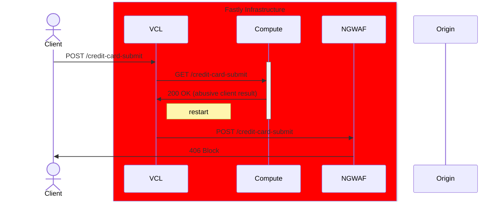
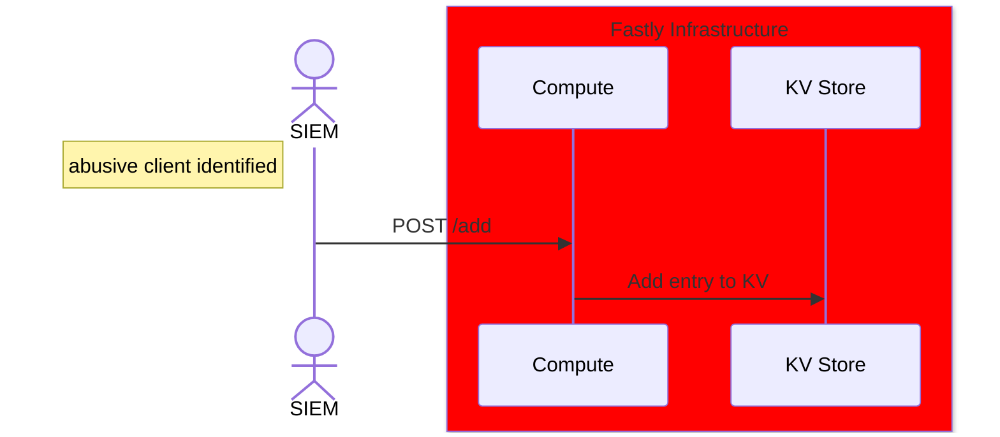

# Enrich requests to the origin via a VCL restart

## Why do this?

Fastly's ERL is great for detecting an mitigating abusive traffic within the available windows. However, SIEMs can have the full picture of all traffic. By using the SIEM to push imformation to the Fastly edge, you are able to detect and mitigate abusive traffic traffic once that traffic is identified by the SIEM.

Following pragmas must be set to true. Open a Support ticket for these to be set.
* fix_unsent_body_drain
* no_body_if_bereq_is_get_or_head

# Workflow with abusive client


# Workflow from webhook


# Tests

## Test by sending a request like the following - Should be allowed

It is advisable to test from a glitch terminal or similar cloud environment. Make note of the public IP used by the client.

```
curl -s "https://[frontend-vcl-service].global.ssl.fastly.net/anything/whydopirates?likeurls=theargs" -d foo=bar | jq '.headers."client-id-lookup"'
curl https://agile-cat-connection.edgecompute.app/get -H fastly-debug:10145-bdn -d foo
```


## Add an entry to the KV store
Update the client ip information in `./service-compute/payload.json` to use the client IP where you are testing from. The run the following command.

```
curl --data @./service-compute/payload.json "https://agile-cat-connection.edgecompute.app/add"
```

## Test by sending a request like the following - Should be blocked

```
curl -s "https://[frontend-vcl-service].global.ssl.fastly.net/anything/whydopirates?likeurls=theargs" -d foo=bar | jq '.headers."client-id-lookup"'
curl https://agile-cat-connection.edgecompute.app/get -H fastly-debug:10145-bdn -d foo
```
