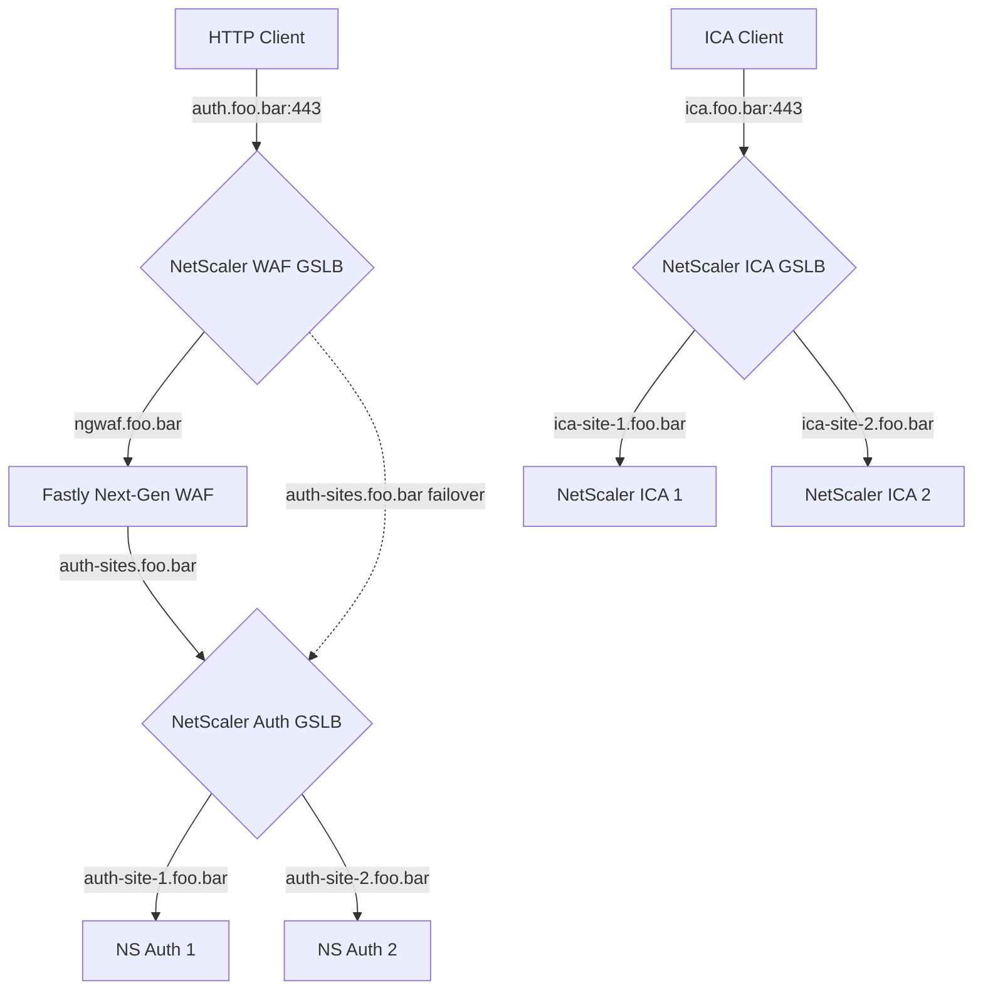

Users may authenticate successfully using HTTP through the NetScaler gateway that is dedicated to authentication. The Setting SSLProxyHost needs to be modified so that after users successfully authenticate, the ICA file that launches the virtual app or desktop will communicate with the NetScaler Gateway VIP that is able to handle the ICA traffic. This is because the Fastly Next-Gen WAF will only handle HTTP based traffic.

[Citrix Default ICA docs](https://docs.citrix.com/en-us/storefront/current-release/configure-manage-stores/default-ica.html)

