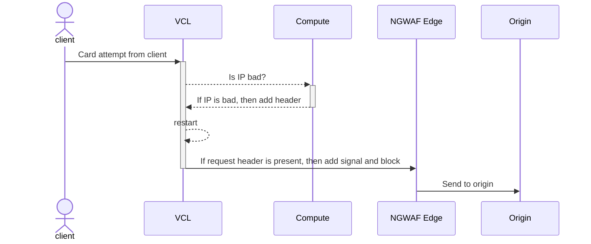
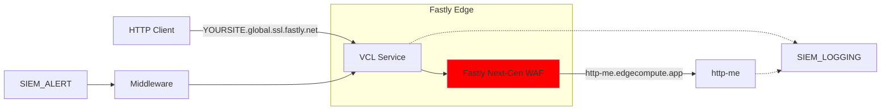

```mermaid
sequenceDiagram
    Actor client
    client->>+VCL: Card attempt from client
    VCL-->>+Compute: Is IP bad?
    Compute-->>-VCL: If IP is bad, then add header
    VCL-->>VCL: restart
    VCL->>-NGWAF Edge: If request header is present, then add signal and block
    NGWAF Edge->>Origin: Send to origin
```

```mermaid
flowchart LR
    Client[HTTP Client]
    VCL_SERVICE[VCL Service]
    NGWAF[Fastly Next-Gen WAF]
    HTTPME[http-me]
    SIEM_WEBHOOK_MIDDLEWARE[Middleware]
    
    Client --> |YOURSITE.global.ssl.fastly.net| VCL_SERVICE
    subgraph fastly_edge[Fastly Edge]
        VCL_SERVICE --> NGWAF
    end
        NGWAF --> |http-me.edgecompute.app| HTTPME
        VCL_SERVICE -.-> SIEM_LOGGING
        HTTPME -.-> SIEM_LOGGING
    

    SIEM_ALERT --> SIEM_WEBHOOK_MIDDLEWARE
    SIEM_WEBHOOK_MIDDLEWARE --> VCL_SERVICE

    classDef fastlyClass fill:#F00
    class NGWAF fastlyClass;

%%Check out styling here, https://mermaid.js.org/syntax/flowchart.html
```